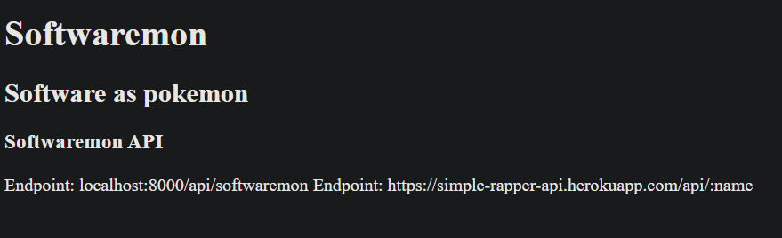

# Softwaremon API
This API returns data on Pokemon based on popular software programs and packages.

**Link to project:** https://softwaremon-api.matthewbozin.repl.co/

## How It's Made:

**Tech used:** HTML, JavaScript, Express, Replit

This is an API built with Express that serves an HTML file, or JSON data of a specific softwaremon depending on the endpoint the user inputs.

## Lessons Learned:

In hosting this project, I've learned how to use Replit for API hosting instead of Heroku!

